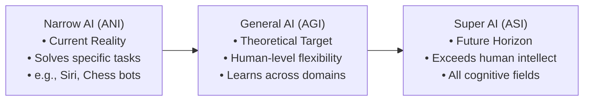
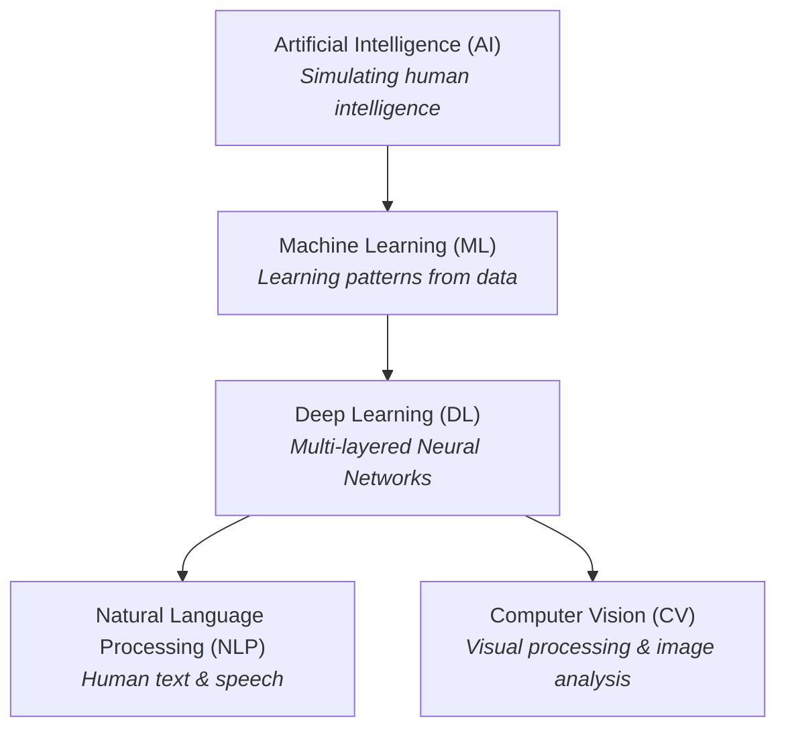
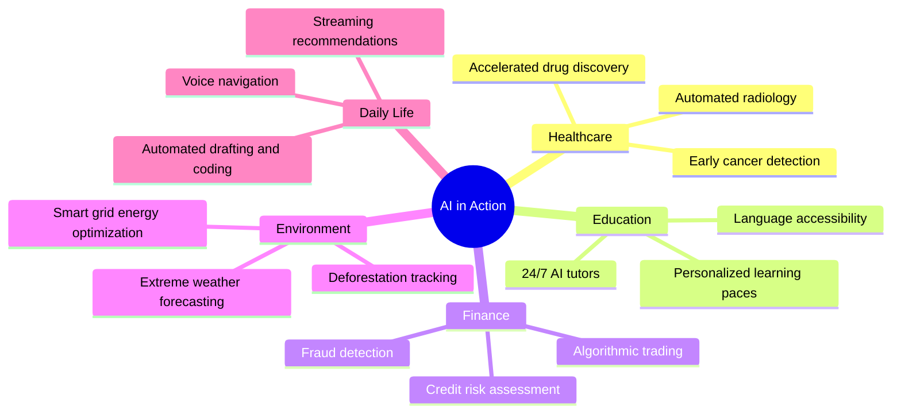
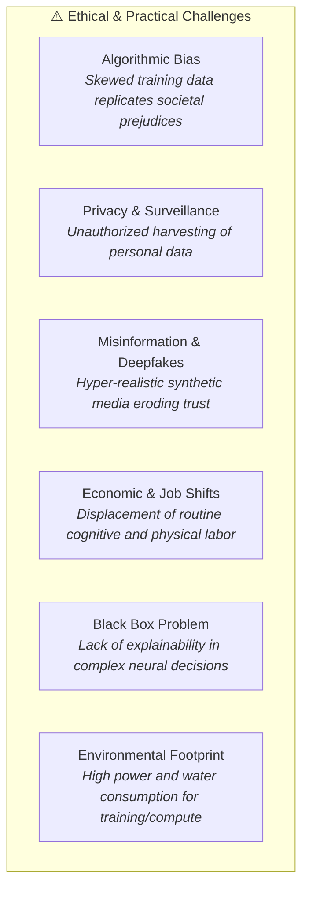

# 📓 Gemini Notebook: Artificial Intelligence (AI)
**A Beginner-Friendly Guide to Foundations, Core Technologies, Ethics, and the Future**

---

## 📌 Table of Contents
1. [Module 1: What is Artificial Intelligence?](#module-1-what-is-artificial-intelligence)
2. [Module 2: A Brief History & Milestones](#module-2-a-brief-history--milestones)
3. [Module 3: Core Technologies of AI](#module-3-core-technologies-of-ai)
   - [Machine Learning (ML)](#1-machine-learning-ml)
   - [Deep Learning (DL)](#2-deep-learning-dl)
   - [Natural Language Processing (NLP)](#3-natural-language-processing-nlp)
   - [Computer Vision (CV)](#4-computer-vision-cv)
4. [Module 4: Real-World Applications Across Industries](#module-4-real-world-applications-across-industries)
5. [Module 5: The Benefits & Opportunities of AI](#module-5-the-benefits--opportunities-of-ai)
6. [Module 6: Risks, Challenges & Ethical Concerns](#module-6-risks-challenges--ethical-concerns)
7. [Module 7: The Future Potential of AI](#module-7-the-future-potential-of-ai)
8. [Module 8: Key Takeaways](#module-8-key-takeaways)
9. [Module 9: Discussion Questions](#module-9-discussion-questions)

---

## Module 1: What is Artificial Intelligence?

### 1.1 Plain English Definition
**Artificial Intelligence (AI)** is a branch of computer science dedicated to building machines and software capable of performing tasks that typically require **human intelligence**. These tasks include learning from experience, recognizing patterns, understanding human language, solving problems, and making decisions.

> 💡 **Simple Analogy:**  
> Traditional software is like a strict **recipe card**—it only follows exact, pre-written steps.  
> AI is like an **apprentice chef** who observes thousands of meals being cooked, understands the flavor profiles, and learns how to adapt the recipe when an ingredient is missing.

---

### 1.2 The Three Levels of AI

1. **Artificial Narrow Intelligence (ANI / Weak AI):**
   - Specialized to perform one specific task exceptionally well.
   - **Examples:** Spam filters, recommendation algorithms (Netflix, YouTube), chess computers, voice assistants.
   - *Status:* **All existing AI today is Narrow AI.**

2. **Artificial General Intelligence (AGI / Strong AI):**
   - Hypothetical AI with human-level cognitive ability to understand, learn, and apply knowledge across diverse, unfamiliar domains.
   - *Status:* In active research and development.

3. **Artificial Superintelligence (ASI):**
   - Hypothetical AI that surpasses the collective intelligence of the best human minds across science, creativity, and social skills.
   - *Status:* Theoretical concept.

---

### 1.3 How AI Works: The Three Pillars
Every modern AI system relies on three fundamental ingredients:
* **Data:** The fuel and textbook (text, images, sensor logs, historical records).
* **Algorithms:** The mathematical logic and statistical models that discover patterns in data.
* **Compute (Hardware):** High-performance processors (CPUs, GPUs, TPUs) required to process massive calculations quickly.

---

## Module 2: A Brief History & Milestones

The journey of AI spans over seven decades, moving through cycles of enthusiastic breakthroughs and periods of reduced funding known as **"AI Winters."**

| Era | Key Milestones & Breakthroughs | Significance |
| :--- | :--- | :--- |
| **1950s** | • **Alan Turing** proposes the *Turing Test* (1950). • **Dartmouth Workshop (1956):** John McCarthy coins the term *"Artificial Intelligence"*. | Birth of AI as a formal scientific discipline. |
| **1960s–1970s** | • Early rule-based systems and chatbots (e.g., ELIZA). • First **"AI Winter"** due to hardware and computational limits. | Exploration of symbolic reasoning and early logic limits. |
| **1980s** | • Rise of **Expert Systems** (knowledge bases for specific business domains). • Second AI Winter follows when maintenance becomes too costly. | AI enters commercial industry, but struggles with real-world complexity. |
| **1990s–2000s** | • **IBM Deep Blue** defeats world chess champion Garry Kasparov (1997). • Shift from hardcoded rules to statistical **Machine Learning**. | Transition toward data-driven probabilistic models. |
| **2010s** | • **Deep Learning explosion:** AlexNet wins ImageNet (2012). • **AlphaGo** defeats Go grandmaster Lee Sedol (2016). | Cloud computing + Big Data + GPUs unlock neural networks. |
| **2020s–Present** | • Transformer models and **Generative AI** (ChatGPT, Gemini, Midjourney, Claude). • Multimodal AI (processing text, audio, video, code simultaneously). | AI becomes an interactive, everyday tool for millions worldwide. |

---

## Module 3: Core Technologies of AI

Modern AI is not a single monolith—it is a family of interconnected subfields.

---

### 1. Machine Learning (ML)
Instead of writing explicit rules for every scenario, Machine Learning algorithms identify underlying patterns in data to make predictions or decisions.

* **Three Main Learning Paradigms:**
  1. **Supervised Learning:** The model trains on labeled input-output pairs (e.g., photos labeled "cat" vs. "dog").
  2. **Unsupervised Learning:** The model analyzes unlabeled data to uncover hidden clusters or patterns (e.g., customer segmentation in e-commerce).
  3. **Reinforcement Learning:** The agent learns through trial-and-error, receiving rewards for good actions and penalties for mistakes (e.g., training a game bot or robotic arm).

> 🔍 **Example:** An email spam filter evaluates millions of emails, noticing that words like *"urgent prize claim"* correlated with spam, adjusting its confidence score over time.

---

### 2. Deep Learning (DL)
Deep Learning is a specialized sub-branch of Machine Learning powered by **Artificial Neural Networks** with multiple interconnected layers (hence "deep").

* **How It Works:** Raw data passes through input layers, multiple hidden layers (extracting features from simple edges up to complex semantic shapes), and an output layer.
* **Key Strength:** Automatically discovers features without requiring human engineers to manually craft them.

> 🔍 **Example:** Facial recognition unlocks a smartphone by first identifying pixel contrast lines $\rightarrow$ facial geometry (eyes, nose distance) $\rightarrow$ full identity verification in milliseconds.

---

### 3. Natural Language Processing (NLP)
NLP gives computers the ability to read, understand, interpret, and generate human language.

* **Core Techniques:**
  * **Tokenization:** Breaking sentences into smaller units (words or sub-words).
  * **Sentiment Analysis:** Detecting emotional tone (positive, negative, neutral).
  * **Large Language Models (LLMs):** Massive neural networks (Transformers) trained on billions of texts to predict the most contextually relevant next words.

> 🔍 **Example:** Real-time language translation tools and conversational assistants that summarize 50-page reports into 5 bullet points.

---

### 4. Computer Vision (CV)
Computer Vision enables computers to extract meaningful information from digital images, video streams, and 3D visual sensors.

* **Core Tasks:**
  * **Image Classification:** "What is in this picture?"
  * **Object Detection & Tracking:** "Where are the pedestrians and vehicles in this video feed?"
  * **Image Segmentation:** Pixel-by-pixel boundary identification.

> 🔍 **Example:** Self-driving cars using cameras and LiDAR to detect lane markings, traffic signs, cyclists, and hazards in real time.

---

## Module 4: Real-World Applications Across Industries

1. **Healthcare & Medicine:**
   - Analyzing MRI scans and X-rays with diagnostic accuracy rivaling specialists.
   - Accelerating molecular design for new vaccines and medications (e.g., AlphaFold predicting protein structures).

2. **Education & Skill Building:**
   - Adaptive learning platforms that adjust difficulty to each student's pace.
   - Real-time language translation and transcription for accessible global classrooms.

3. **Finance & Commerce:**
   - Detecting credit card fraud within fractions of a second by spotting anomalous spending habits.
   - Personalized product recommendations and predictive inventory management.

4. **Environmental Science & Agriculture:**
   - Satellite image analysis to monitor deforestation, ocean health, and crop disease.
   - Optimizing irrigation and fertilizer use via precision agricultural drones.

---

## Module 5: The Benefits & Opportunities of AI

| Benefit Area | Description | Practical Impact |
| :--- | :--- | :--- |
| **Automation & Efficiency** | Handles repetitive, routine, and high-volume tasks. | Frees humans to focus on creative, strategic, and high-empathy endeavors. |
| **Data Processing at Scale** | Uncovers complex correlations across petabytes of data in seconds. | Rapid insights in scientific research, genomics, and global economics. |
| **Continuous Availability** | Systems operate 24/7 without fatigue or degradation in attention. | Continuous emergency response, customer support, and system monitoring. |
| **Enhanced Safety** | Deployed in dangerous environments (deep sea exploration, disaster zones, bomb disposal). | Reduces human injury and risk in hazardous industries. |

---

## Module 6: Risks, Challenges & Ethical Concerns

A balanced understanding of AI requires acknowledging its significant challenges:

### 1. Algorithmic Bias & Fairness
If an AI system trains on historical data containing human biases (e.g., historical hiring patterns or loan approvals), the AI can perpetuate and amplify discrimination at scale.

### 2. Privacy & Data Rights
Training cutting-edge models requires vast datasets, raising vital questions about user consent, copyright protection, intellectual property, and facial surveillance.

### 3. Misinformation & Synthetic Media
Generative tools can produce convincing fake audio, videos (deepfakes), and fabricated articles, complicating the distinction between authentic and falsified information.

### 4. Workforce Transformation
While AI creates new roles (AI trainers, prompt engineers, safety auditors), it also automates tasks previously performed by humans (copywriting, routine data entry, basic customer service), demanding proactive workforce reskilling.

### 5. The "Black Box" Problem (Explainability)
Many advanced deep learning models make accurate predictions without providing an easily human-interpretable rationale—a critical risk in high-stakes fields like judicial sentencing or medical diagnosis.

---

## Module 7: The Future Potential of AI

Looking forward, AI is transitioning from standalone software tools to ubiquitous, collaborative systems:

* **Multimodal Reasoning:** Seamlessly integrating text, speech, touch, code, and vision to understand context as humans do.
* **Embodied AI (Robotics):** Bringing intelligence into physical robotic systems capable of navigating unpredictable real-world environments (elderly care, disaster recovery, warehouse logistics).
* **AI-Accelerated Science:** Discovering novel room-temperature superconductors, battery chemistries, and climate mitigation materials.
* **Human-AI Symbiosis:** Moving away from replacement toward **Augmented Intelligence**, where humans leverage AI as an intellectual co-pilot to expand human potential.
* **Global Governance & Safety:** Establishing international frameworks, safety evaluations, and technical guardrails to ensure AI systems remain safe, aligned, and beneficial to humanity.

---

## Module 8: Key Takeaways

* **Core Definition:** AI is the science of creating machines that simulate human cognitive abilities like learning, reasoning, and pattern recognition.
* **Current State:** All practical AI today is **Narrow AI**—highly capable in specific tasks, but lacking general consciousness or true understanding.
* **The Tech Hierarchy:** AI is the overarching field $\rightarrow$ Machine Learning is the method of learning from data $\rightarrow$ Deep Learning utilizes multi-layer neural networks $\rightarrow$ NLP and Computer Vision are specialized perception domains.
* **Duality of Impact:** AI offers unprecedented potential for scientific discovery, healthcare, and productivity, but requires rigorous solutions for bias, privacy, copyright, safety, and workforce transitions.
* **Responsible Stewardship:** The trajectory of AI depends on ethical design, thoughtful regulation, and proactive human-centered development.

---

## Module 9: Discussion Questions

1. **AI in Everyday Decisions:**  
   *If an AI algorithm recommends a medical diagnosis or denies a loan application, should it be mandatory for the system to explain its exact step-by-step reasoning before the decision is accepted? Why or why not?*

2. **The Nature of Creativity:**  
   *When an AI model generates award-winning artwork, music, or literature by learning from millions of human artists, who should hold the moral and financial ownership: the prompt author, the AI developers, or the original artists whose work trained the model?*

3. **Workforce and Education:**  
   *As AI systems become proficient in writing, coding, and mathematical calculations, how should school curricula and university education evolve to prepare students for an AI-augmented job market?*

4. **Bias and Fairness:**  
   *Can an AI system ever be completely unbiased, or will it inevitably reflect the conscious and unconscious biases of the humans who create the data and train the models?*

5. **Future Autonomy and AGI:**  
   *If humanity eventually develops Artificial General Intelligence (AGI), what ethical guardrails and safety protocols should be globally agreed upon before granting such systems autonomy in critical infrastructure?*
